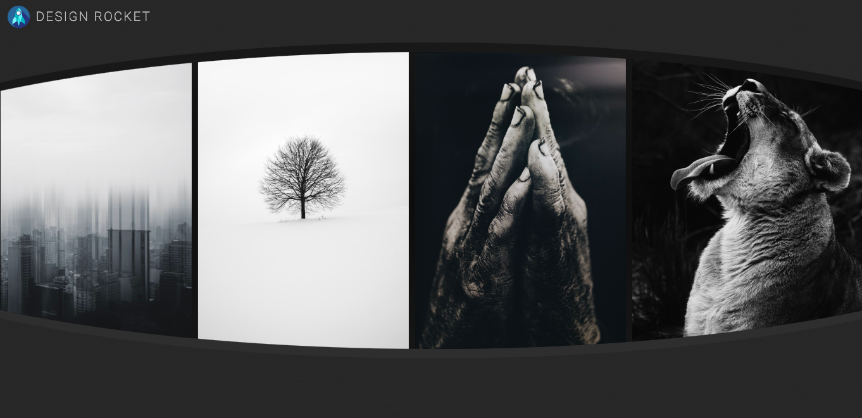
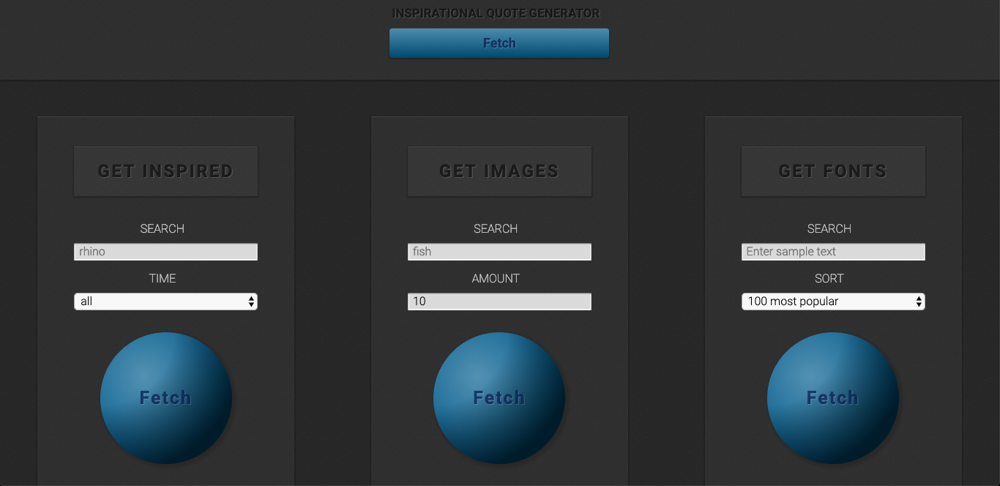

# Design Rocket

**What is it?**

A dashboard app that allows users to search and display results from common web development design tools.

**Why does it exist?**

So developers only need to have one browser window open to use many common design tools on a clean unified UI.

**What API's does it use?**

1. Behance
2. Unsplash
3. Google Fonts
4. Quotes on Design

## Built with

HTML + CSS + JavaScript + jQuery

## Live app

https://isaacdpierce.github.io/design-rocket/

## Code

https://github.com/isaacdpierce/design-rocket
